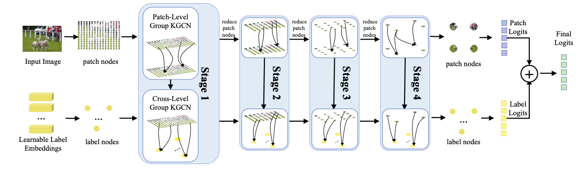

# GKGNet

## Introduction

This repo contains the official PyTorch implementation of our ECCV'2024 paper
[GKGNet: Group K-Nearest Neighbor based Graph Convolutional Network for Multi-Label Image Recognition](https://arxiv.org/abs/2308.14378).

## Acknowledgement
This repo is developed based on [MMPreTrain](https://github.com/open-mmlab/mmpretrain). 

## License
GKGNet is freely available for free non-commercial use, and may be redistributed under these conditions. For commercial queries, please contact Mr. Sheng Jin (jinsheng13[at]foxmail[dot]com). We will send the detail agreement to you.
